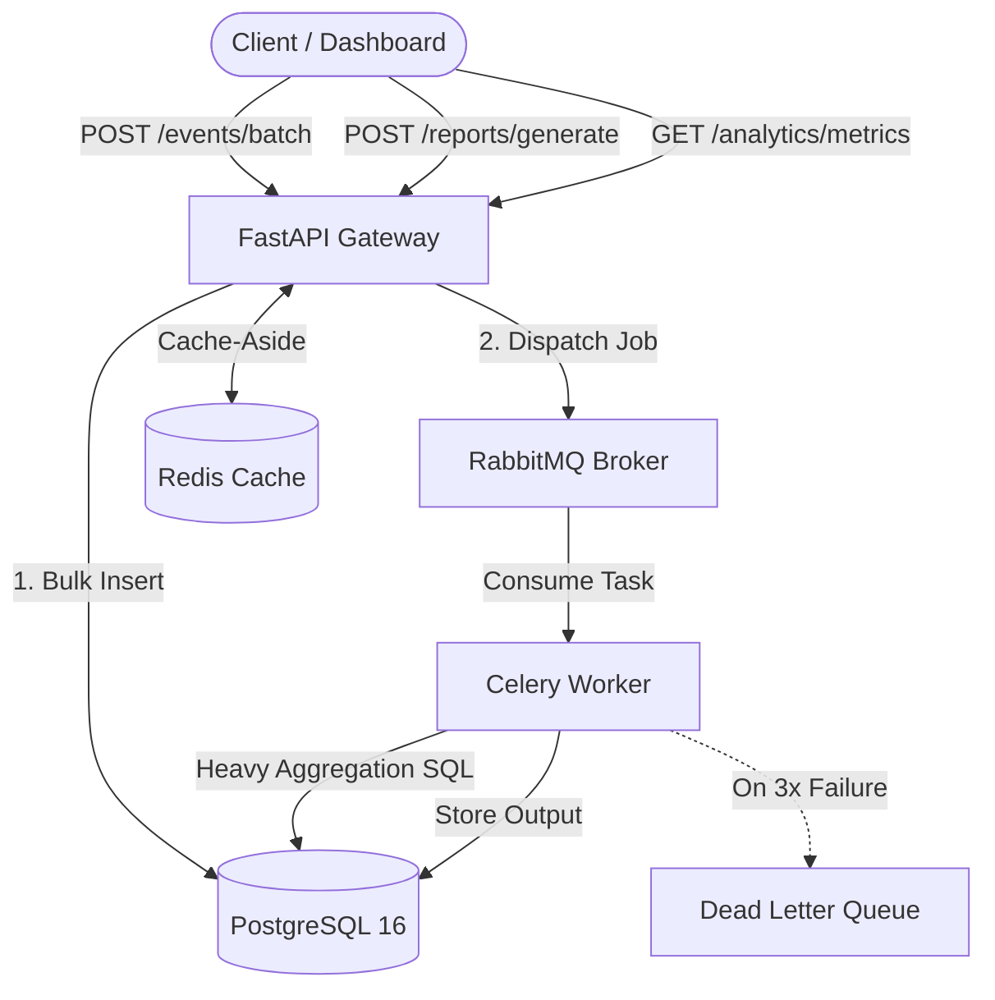

# Asynchronous E-Commerce Report Engine

> **Scope contract:** see [INTENT.md](./docs/INTENT.md) — what this service must do and why.
> **Original brief:** see [ASSIGNMENT.md](./docs/ASSIGNMENT.md).

A backend service that ingests high-volume e-commerce order events and produces heavy
analytical reports **without ever blocking an HTTP request**. Ingestion validates and
bulk-inserts only; report generation runs on separate worker processes over a message
queue; dashboard reads are served from Redis.

**Stack:** FastAPI (async) · PostgreSQL 16 (async SQLAlchemy 2.0) · Celery + RabbitMQ ·
Redis · pytest + Testcontainers · CI: ruff + mypy + pytest (zero lint / zero type errors).

---

## 1. System overview



**Clean Architecture** — each layer only talks to the one below it:

| Layer | Responsibility | Rule |
| --- | --- | --- |
| `app/api/` | FastAPI routers + Pydantic schemas | No logic, no SQL — delegate to services |
| `app/services/` | Orchestration: repositories + cache + workers | The only layer that wires components together |
| `app/repositories/` | Database access | The only place SQLAlchemy queries are written |
| `app/domain/` | SQLAlchemy models, domain exceptions | Imports nothing from `app/` |
| `app/workers/` | Celery tasks + broker config | Heavy compute lives here, not in the API |
| `app/core/` | Config, DB engines, Redis client, structured logging | Shared by API and worker |

---

## 2. Run it

```bash
docker-compose up --build          # API :8000, Celery worker, PostgreSQL, Redis, RabbitMQ
```


## 3. Engineering trade-offs & decisions

The core design question is *"how do you run an expensive aggregation without degrading
the ingestion path?"* Every decision below follows from that.

| Decision | Chosen | Rejected alternative | Why |
| --- | --- | --- | --- |
| Background execution | **Celery + RabbitMQ** | FastAPI `BackgroundTasks` | `BackgroundTasks` run in the API process — a heavy aggregation would compete with the event loop and die with the pod on redeploy. Celery workers are separate processes in separate containers, scale independently, and survive an API restart. |
| Broker | **RabbitMQ** | Redis Pub/Sub / Redis lists | Pub/Sub drops messages with no consumer online — unacceptable for a report job. RabbitMQ gives durable queues, per-message acknowledgement, and native dead-letter routing. Redis stays dedicated to the cache so a queue backlog can't evict cache entries. |
| `created_at` index | **B-Tree** `INCLUDE (total_amount)` | Hash index | Reports filter a **date range** (`created_at BETWEEN …`). Hash indexes only serve equality. The B-Tree also supports an Index Only Scan for `count/sum/avg` because `total_amount` is in the leaf. |
| Ingestion write | **Single bulk `INSERT`** | Row-by-row ORM inserts | One round trip and one transaction for the whole batch; keeps `POST /events/batch` in the low-milliseconds range regardless of batch size. |
| Dashboard reads | **Cache-Aside (Redis)** | Read replica / materialized view | The metrics window is small and hot; a TTL'd cache entry absorbs the repeated dashboard polls with no extra infrastructure, and is invalidated on ingest. |
| Idempotency | **`Idempotency-Key` → hash in Redis, TTL** | DB unique constraint only | Stops a retried batch before it touches Postgres; the `order_id` unique constraint is the backstop for anything that slips through. |

### Edge cases handled

- **Duplicate ingestion under retry** — replaying a batch with the same `Idempotency-Key`
  is a no-op; `duplicates` is reported back in the response.
- **Reversed date range** — `date_from > date_to` is rejected at the schema layer with the
  structured error envelope, before any work is scheduled.
- **Permanently failing job** — a task that fails 3 consecutive times (`autoretry_for`,
  exponential backoff) is routed to a `DEAD_LETTER` state via the task's `on_failure`
  handler instead of blocking the main queue. The report resource reflects
  `status = DEAD_LETTER` so the client stops polling.
- **Cold cache / stale cache** — a miss recomputes from Postgres and repopulates; ingest
  invalidates the key so the next read is fresh.

---

## 4. Data-backed verification

### 4.1 Index performance (`database_migrations/explain_benchmark.sql`)

The script seeds a large synthetic `orders` dataset (`created_at` correlated with insert
order — a realistic append-only events table), runs `VACUUM ANALYZE`, then runs
`EXPLAIN (ANALYZE, BUFFERS)` on the exact query the app issues (a `created_at` range
aggregating `total_amount`), first **with** `idx_orders_created_at` and then **with it
dropped**.

**Claim proven:** the range aggregation resolves through an index-based access path on
`idx_orders_created_at` (an *Index Only Scan* once the visibility map is set by `VACUUM`),
reading a handful of index pages instead of the whole heap. Dropping the index forces a
**Sequential Scan** over the full table for the same result.

#### Index Performance Verification (150,000 Rows Dataset)

Query: aggregating order count, total revenue and average order value across a rolling
2-day date window (~2% of a 150,000-row table). Measured from a real
`EXPLAIN (ANALYZE, BUFFERS)` run against PostgreSQL 16 in the `docker-compose` `db`
service. The buffer counts and plan shape are deterministic across runs; absolute
execution time varies by hardware and (for the seq scan) run-to-run — run the script
to get your own.

* **Without Index (`Parallel Seq Scan`):** `Buffers: shared hit=2235`, 73,560 rows
  removed by filter per worker, `Execution Time` ≈ 19–25 ms.
* **With Covering Index (`Index Only Scan`):** `Buffers: shared hit=15`,
  `Heap Fetches: 0`, `Execution Time` ≈ 0.6 ms.
* **Optimization Gain:** buffer reads drop from 2235 to 15 (**~150x fewer pages**),
  zero heap fetches once the visibility map is synchronized by `VACUUM`, and a
  **~30–40x latency reduction** on this machine.

`test_integration.py::test_report_query_uses_created_at_index_not_seq_scan` asserts the
weaker, hardware-independent half of this against a real PostgreSQL 16: that
`idx_orders_created_at` appears in the plan and `Seq Scan` does not (an *Index Only
Scan*, *Index Scan* or *Bitmap Index Scan* all pass). It runs against the `db` service
in CI and via `docker-compose run --rm -e TEST_DATABASE_URL=... api pytest` locally, and
falls back to a Testcontainers Postgres when `TEST_DATABASE_URL` is unset and a Docker
daemon is reachable.

```bash
docker-compose exec -T db psql -U user -d analytics_db < database_migrations/explain_benchmark.sql
```

### 4.2 Cache-Aside effectiveness

`GET /analytics/metrics` on a hit returns straight from Redis with no Postgres round trip
and no aggregation. On a miss it runs one indexed range query, writes the result to Redis
with a short TTL, and returns. Ingestion deletes the key, so a dashboard never shows a
window that predates the latest batch.

---

## 5. Resilience & production readiness

| Concern | Mechanism |
| --- | --- |
| **Duplicate work** | `Idempotency-Key` (Redis, TTL) on ingestion + `order_id` unique constraint |
| **Transient task failure** | `autoretry_for=(Exception,)`, exponential backoff |
| **Permanent task failure** | 3 failures → `DEAD_LETTER` state via `on_failure`; main queue keeps draining |
| **Slow dependency at startup** | Compose services are healthcheck-gated; schema initialized before the API accepts traffic |
| **Observability** | `app.core.logging` — single JSON formatter shared by API and worker; configures idempotently (tested) |
| **Regression safety** | ruff + mypy + full pytest (unit + integration) on every push/PR against a `postgres:16` service |

---

## 6. API reference

Base path: `/api/v1`

### `POST /events/batch` → `202`
Ingest a batch of order events. Validates, bulk-inserts, returns immediately — no compute.

| Header | Required | Purpose |
| --- | --- | --- |
| `Idempotency-Key` | yes | Replaying a batch with the same key is a no-op (no duplicate rows). |

```json
// request
{ "events": [ {
  "order_id": "ord_1001", "customer_id": "cus_42", "status": "paid",
  "total_amount": 129.90, "region": "EU", "created_at": "2026-08-30T10:15:00Z"
} ] }
// response
{ "status": "accepted", "ingested": 1, "duplicates": 0 }
```

### `POST /reports/generate` → `202`
Dispatch a background aggregation job. Returns a `task_id` to poll.

```json
// request
{ "report_type": "revenue_summary", "date_from": "2026-08-01",
  "date_to": "2026-08-31", "group_by": ["region", "status"] }
// response
{ "task_id": "rpt_7f3a2c", "status": "PENDING" }
```

### `GET /reports/{task_id}` → `200`
Poll one report resource.

```json
{ "task_id": "rpt_7f3a2c", "status": "SUCCESS", "result": {
  "total_revenue": 184230.55, "order_count": 1920, "average_order_value": 95.95,
  "by_region": { "EU": 90120.00, "US": 71110.55, "APAC": 23000.00 },
  "by_day": [ { "day": "2026-08-01", "revenue": 6011.20 } ],
  "growth_vs_previous_period": 0.14
} }
```

`status`: `PENDING → STARTED → SUCCESS`, or `→ FAILURE`, or `→ DEAD_LETTER` (permanently
failed after retries). `result` is `null` until `SUCCESS`.

### `GET /analytics/metrics` → `200`
Rolling summary (default: last 24h). Cache-Aside: Redis on a hit; on a miss, aggregated
from PostgreSQL and cached with a short TTL. Invalidated when new events are ingested.

```json
{ "window": "24h", "revenue": 12043.10, "order_count": 138,
  "average_order_value": 87.27, "orders_by_region": { "EU": 61, "US": 55, "APAC": 22 } }
```

### Errors
Consistent structure across all endpoints:

```json
{ "detail": [ { "loc": ["body", "events", 0, "total_amount"], "msg": "value must be >= 0", "type": "value_error" } ] }
```

---

## 7. Database

**`orders`** — `id`, `order_id` (unique), `customer_id`, `status`, `total_amount`,
`region`, `created_at`.

**`reports`** — `id`, `task_id` (unique), `report_type`, `params` (JSONB), `status`,
`result` (JSONB), `created_at`, `updated_at`.

**Indexes** — the report/analytics queries filter `orders` by a `created_at` range and
aggregate `total_amount` via `count(*)` / `sum` / `avg` (no column outside the index), so
the covering index answers from an Index Only Scan once the visibility map is set
(autovacuum in production; `VACUUM ANALYZE` in the benchmark), an Index Scan otherwise.
The composites back the `GROUP BY region` / `GROUP BY status` breakdowns:

```sql
CREATE INDEX idx_orders_created_at        ON orders (created_at DESC) INCLUDE (total_amount);
CREATE INDEX idx_orders_status_created_at ON orders (status, created_at DESC);
CREATE INDEX idx_orders_region_created_at ON orders (region, created_at DESC);
```


Services are healthcheck-gated; the schema is initialized before the API accepts traffic.

- API docs: http://localhost:8000/docs
- Health: http://localhost:8000/health

### Tests

```bash
# full suite (17 unit/worker/logging + 3 integration) against the compose db
docker-compose run --rm \
  -e TEST_DATABASE_URL=postgresql+psycopg://user:password@db:5432/analytics_db \
  api pytest -v --cov=app tests/

# unit-only (no DB): omit TEST_DATABASE_URL — the 3 integration tests then
# use Testcontainers if a Docker socket is reachable, else skip.
docker-compose run --rm api pytest -v --cov=app tests/
```

- **Unit** (`test_api.py`) — schema validation (incl. reversed date ranges), the
  structured-error envelope, route delegation, and the ingestion service's idempotency +
  cache invalidation, with DB and Redis mocked.
- **Logging** (`test_logging.py`) — `app.core.logging` emits JSON and configures idempotently.
- **Integration** (`test_integration.py`) — report aggregation SQL and the
  `idx_orders_created_at` query plan against a real PostgreSQL 16. Uses
  `TEST_DATABASE_URL` when set (the compose `db`, or the CI `postgres:16`
  service), otherwise a Testcontainers Postgres; skipped only when neither is
  available.
- **Worker** (`test_workers.py`) — state transitions, deterministic re-run, and
  `DEAD_LETTER` routing via the task's `on_failure` handler.

### Index benchmark

```bash
docker-compose exec -T db psql -U user -d analytics_db < database_migrations/explain_benchmark.sql
```

See [§4.1](#41-index-performance-database_migrationsexplain_benchmarksql). 

---

## 9. Quality gates (CI)

On every push / PR: `ruff` (lint) + `mypy` (types) + `pytest` (tests + coverage).
Zero linter and zero typing errors required.
